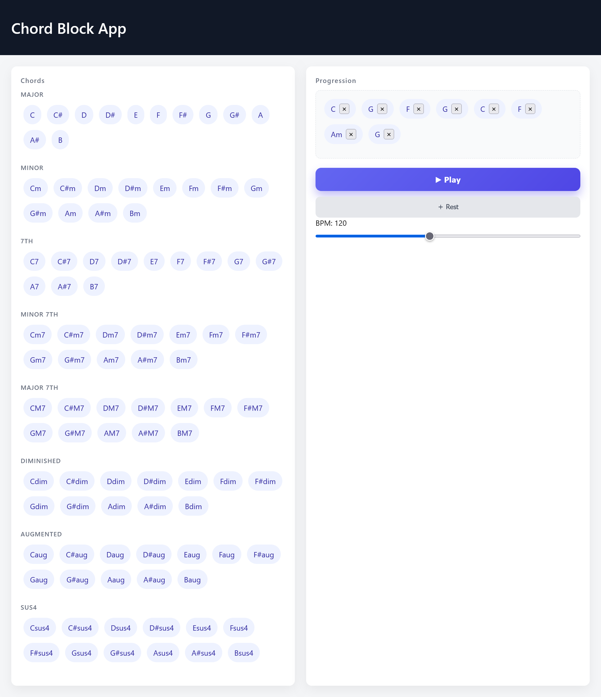

# 🎹 Chord Block App

コード進行を **ブロック感覚で作成・再生** できる Web アプリです。  
音楽理論の学習や作曲アイデア出しを目的として、個人開発しました。

---

## 🚀 概要

- コードを **クリックで追加**
- 並べたコード進行を **ワンクリックで再生**
- BPM（テンポ）をリアルタイムに変更可能
- **全キー × 複数コードタイプ**に対応
- ブラウザ上で動作（インストール不要）

---

## 🎼 対応コード

以下のコードタイプを **全12キー** で実装しています。

- Major
- Minor
- 7th
- Minor 7th
- Major 7th
- Diminished
- Augmented
- Sus4

コードはタイプごとに **グループ分け表示** されています。

---

## 🛠 使用技術

- **HTML / CSS / JavaScript**!
- **Tone.js**（Web Audio API ラッパー）
- GitHub Pages（公開）

---

## 🎮 使い方

1. 上部の **コードパレット** からコードをクリック
2. 下部の **Progression** に追加される
3. 「▶ Play」ボタンで再生
4. 不要なコードは「×」で削除
5. 「Rest」ボタンで休符追加
6. BPM スライダーでテンポ調整

---

## 💡 開発背景

- 音楽理論を **視覚的・直感的に理解**したかった
- DAW を開かずにコード進行を試したかった
- JavaScript と Web Audio API の理解を深めたかった

---

## 📌 今後の改善予定

- コードのドラッグ＆ドロップ並び替え
- 小節・拍単位での再生
- キー設定・スケール表示
- MIDI 書き出し機能
- バックエンド（FastAPI）との連携検討

---

## 📄 ライセンス

MIT License
